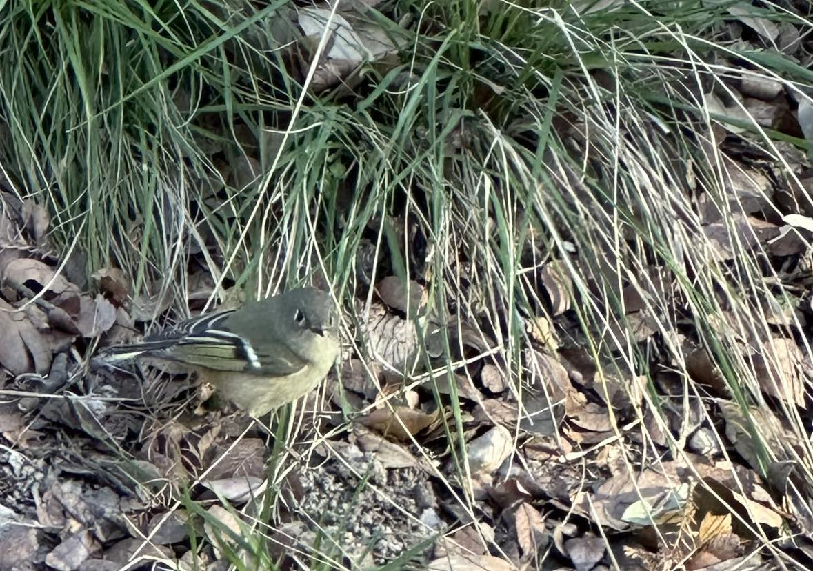

# eBird Data

exploring ways to share ebird data, specifically for Bexar Audobon Society (BAS)

### vizzes
learning to tableau: 
[dashboarding](https://public.tableau.com/app/profile/misty.garcia2134/vizzes)

### real bird

*ruby-crowned kinglet taken by misty garcia on an iphone*

